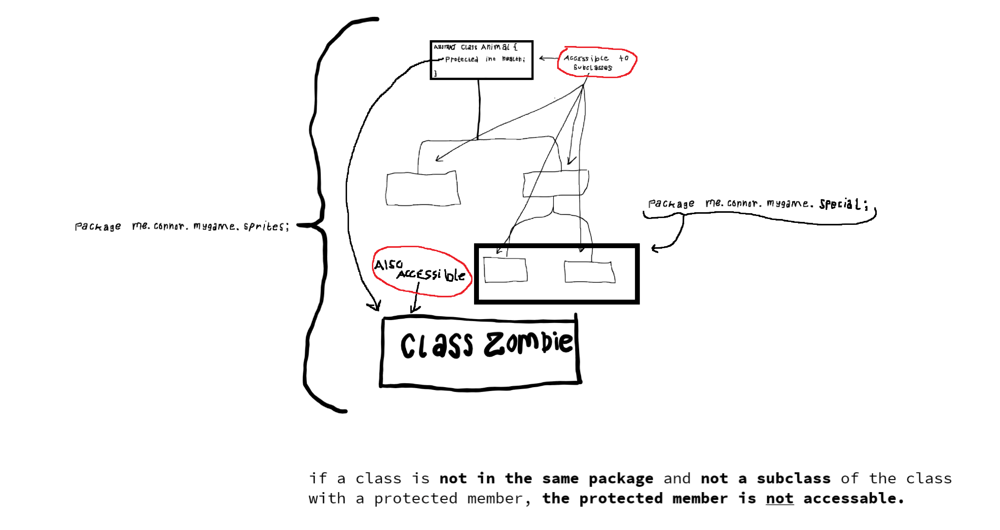

# Java Notes

---
## Vocabulary
* Class member - anything declared within a class (functions, variables, constants).
---

## Keywords

### Accessibility Modifiers
* `public` - Makes something universally accessable to the entire project.
* `private` - Makes something only available to...
    * In the context of a class:
        * **Cannot be applied to the outer-most class, only embedded classes (i.e. event handlers, interface implementations, etc.)**
        * Applying `private` to an embedded class will only allow access to members of the "container" class,\
        or, in other words, it only allows the class in which the private class lies to access its members.
    * In the context of class members, applying the `private` modifier to a class member will only allow internal usage of said member.
* `protected` - Only allows access to classes of the same package, and to any subclass of a class.
  
  
### "Behavioral Modifiers"
* `static` - 

